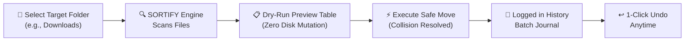

<div align="center">


### Professional Desktop File Organizer & Smart Triage Engine
#### 🪟 Windows · 🍎 macOS · 🐧 Linux · 🐍 Python 3.10+ · 🎨 CustomTkinter

[](https://www.python.org/)
[](https://github.com/TomSchimansky/CustomTkinter)
[](file:///c:/Users/USER/OneDrive/Desktop/Sortify/tests)
[](https://github.com/brainiacweb-tech/sortify/blob/main/LICENSE)


**[📚 About](#-sortify-in-plain-words)** ·
**[🖥️ App Features](#%EF%B8%8F-desktop-features--tour)** ·
**[🚀 Quickstart](#-quickstart)** ·
**[🏗️ Architecture](#%EF%B8%8F-architecture--project-structure)** ·
**[🧪 Quality & Tests](#-quality-and-testing)** ·
**[🤝 Contributing](#-contributing)**

</div>

---

> [!TIP]
> **Not a programmer? You don't need to write any code.** SORTIFY comes as a clean, high-performance desktop application:
> clone or download the app, run `python main.py`, select any folder (`Downloads`, `Desktop`, `Documents`), preview dry-run triage, detect duplicate downloads with SHA-256, and organize your files with 100% safety and instant 1-click **UNDO**.

---

## 📖 Table of Contents

- [SORTIFY in Plain Words](#-sortify-in-plain-words) ← Start here
- [Desktop Features & Tour](#%EF%B8%8F-desktop-features--tour)
  - [📊 Analytics Dashboard](#1--analytics-dashboard)
  - [📁 Organize Files & Dry-Run Preview](#2--organize-files--dry-run-preview)
  - [🔍 Cryptographic Duplicate Finder](#3--cryptographic-duplicate-finder)
  - [📜 Activity History & 1-Click Undo](#4--activity-history--1-click-undo)
  - [⚙️ Custom Classification Rules](#5-%EF%B8%8F-custom-classification-rules)
  - [🛠️ Preferences & Themes](#6-%EF%B8%8F-preferences--visual-themes)
- [Safety Guarantees](#-safety-guarantees)
- [Quickstart](#-quickstart)
- [Architecture & Project Structure](#%EF%B8%8F-architecture--project-structure)
- [Quality and Testing](#-quality-and-testing)
- [Developer Credit](#-developer--author)
- [Licence](#-license)

---

## 🧒 SORTIFY in Plain Words

*No computer background needed for this section.*

### 🛒 Meet Kwame
Kwame is a student and content creator. Every day he downloads dozens of PDFs, lecture slides, ZIP archives, photos, audio tracks, and code files into his `Downloads` and `Desktop` folders. 

After a few months, he faces **four major problems**:

1. 😵 **Unmanageable Clutter**: Hundreds of unorganized files are mixed together in one huge folder. Finding a single document takes minutes.
2. 💾 **Wasted Storage**: Repeatedly downloading the same file creates hidden duplicates (e.g. `report(1).pdf`, `report(2).pdf`) that waste gigabytes of disk space.
3. ⚠️ **Fear of Data Loss**: Using simple scripts or manual drag-and-drop risks silently overwriting important documents with identical names.
4. ❌ **No Safety Net**: If a batch move goes wrong, there's no easy way to return files to their exact original locations.

**SORTIFY is a smart, zero-risk desktop assistant that solves all four.**

---

### 🧰 The Helpers Inside SORTIFY

| Helper Module | What It Does for You |
|---|---|
| 📁 **Categorical Classifier** | Automatically sorts files into clean category folders (`Images`, `PDFs`, `Documents`, `Spreadsheets`, `Presentations`, `Videos`, `Audio`, `Archives`, `Code`, `Applications`, `Fonts`, `Others`) based on extension rules. |
| 🛡️ **Collision Resolver** | Guarantees zero overwrites by generating collision-free names (e.g., `photo_1.jpg`, `photo_2.jpg`) if a target file already exists. |
| 🔍 **Duplicate Detector** | Uses a 2-stage SHA-256 algorithm (size grouping + 1 MB chunk hashing) to find exact byte-for-byte duplicate files without memory spikes. |
| 📋 **Dry-Run Preview** | Lets you see the exact destination of every file and collision warnings **before** writing any changes to disk. |
| 📜 **Action Journal & Undo** | Records every batch move in a persistent history log and provides **1-click restore** to move files back to original paths. |
| ⚙️ **Rules & Settings Manager** | Lets you create custom file categories, set custom extensions, toggle date-based subfolders (`Images/2026/October`), and switch dark/light themes. |

---

### 🔄 How SORTIFY Works, Step by Step



1. **Pick a Folder**: Select your target folder (or run `create_demo_files.py` for a safe sample sandbox).
2. **Scan & Preview**: SORTIFY calculates category destinations, flags potential collision renames, and detects duplicate downloads.
3. **Execute Safely**: Move files with 100% collision-free path guarantee.
4. **Undo Whenever Needed**: Click **Undo Batch** in the history log to return files instantly.

---

## 🖥️ Desktop Features & Tour

SORTIFY features a modern, responsive two-column layout built with CustomTkinter and typography powered by Google Font **Raleway**.

---

### 1. 📊 Analytics Dashboard

Get an immediate visual summary of your storage health and organization history:
- **Files Organized**: Total count of categorized files.
- **Organization Runs**: Recorded execution batches.
- **Duplicates Found**: Number of exact duplicate files detected.
- **Category Distribution**: Live percentage progress bars displaying space breakdown across file types.

---

### 2. 📁 Organize Files & Dry-Run Preview

- **Folder Selector**: Easily browse any target folder path.
- **Option Toggles**: `Include Subfolders (Recursive)` and `Check Duplicates`.
- **Interactive Dry-Run Table**: Shows original filename, assigned category, target destination path, file size, and collision/duplicate status before moving any file.
- **Progress Feedback**: Real-time progress bar with an immediate **Cancel** button during background scans.

---

### 3. 🔍 Cryptographic Duplicate Finder

- **Multi-Stage Engine**:
  1. *Size Filter*: Groups files by exact `stat().st_size`. Unique file sizes are skipped instantly.
  2. *Chunk Hashing*: Size candidate groups are hashed using SHA-256 in 1 MB chunks.
- **Quarantine Safety**: Move selected duplicate copies into a dedicated `Duplicates/` folder. No automatic permanent file deletions.

---

### 4. 📜 Activity History & 1-Click Undo

- **Audit Journal**: View past organization runs by timestamp, base folder, and file count.
- **Operation Details**: Inspect individual file moves (`Source Path -> Destination Path`).
- **1-Click Undo**: Click **↩️ Undo Batch** to safely return all moved files to their original locations.

---

### 5. ⚙️ Custom Classification Rules

- Add or update custom file categories and extension mappings.
- Customize target folder names.
- Single-click **Reset to Defaults** button.

---

### 6. 🛠️ Preferences & Visual Themes

- **Appearance Mode**: Dark, Light, or System default theme.
- **Date-Based Organization**: Toggle Year/Month subfolder structure (e.g., `Images/2026/October`).
- **Safety Prompts**: Toggle mandatory confirmation dialogs before batch moves.

---

## 🛡️ Safety Guarantees

- **Zero Overwrite Risk**: Destination files never replace existing files; collision resolution generates safe names (`filename_1.ext`).
- **System Drive Safeguards**: Refuses to scan or organize OS system root drives (e.g. `C:\`, `C:\Windows`).
- **100% Offline & Private**: Runs locally on your machine. No telemetry or cloud uploads.

---

## 🚀 Quickstart

### Prerequisites
- Python 3.10 or higher installed.

### 1. Clone Repository
```bash
git clone https://github.com/brainiacweb-tech/sortify.git
cd sortify
```

### 2. Install Dependencies
```bash
pip install -r requirements.txt
```

### 3. Generate Sample Sandbox (Optional)
Generate a populated demo folder with sample PDFs, images, documents, code, and duplicate files to test the app safely:
```bash
python create_demo_files.py
```

### 4. Launch SORTIFY Desktop Application
```bash
python main.py
```

---

## 🏗️ Architecture & Project Structure

```
sortify/
├── app/
│   ├── assets/
│   │   ├── logo.png                   # SORTIFY Brand Logo
│   │   └── Raleway-VariableFont.ttf   # Raleway Google Font
│   ├── config/
│   │   └── default_rules.json         # Default extension-to-category rules
│   ├── core/
│   │   ├── file_classifier.py         # Extension evaluation engine
│   │   ├── file_operations.py         # Safe move & collision resolution
│   │   ├── duplicate_detector.py      # 2-stage SHA-256 duplicate engine
│   │   ├── undo_manager.py            # Activity history journal & undo restore
│   │   └── organizer.py                # Master flow orchestrator
│   ├── gui/
│   │   ├── main_window.py             # Top-level window & sidebar router
│   │   ├── dashboard.py               # Analytics dashboard view
│   │   ├── organize_view.py           # Dry-run preview & move controls
│   │   ├── duplicates_view.py         # Duplicate inspector & quarantine
│   │   ├── history_view.py            # Activity log & 1-click undo
│   │   ├── rules_view.py              # Custom rules manager
│   │   ├── settings_view.py           # Preferences & theme switcher
│   │   └── components.py              # Reusable CustomTkinter widgets
│   ├── services/
│   │   ├── config_service.py          # Persistent JSON settings manager
│   │   ├── logging_service.py         # Runtime log configuration
│   │   └── stats_service.py           # Analytics calculator
│   └── utils/
│       ├── constants.py               # Application constants & font settings
│       ├── helpers.py                 # Size formatters & collision helpers
│       └── validators.py              # Path validation & system drive safeguards
├── tests/                             # Comprehensive Pytest test suite
│   ├── test_classifier.py
│   ├── test_duplicates.py
│   ├── test_file_operations.py
│   ├── test_organizer.py
│   └── test_undo.py
├── main.py                            # Application entry point
├── create_demo_files.py               # Demo sandbox generator
├── requirements.txt
├── README.md
└── LICENSE
```

---

## 🧪 Quality and Testing

SORTIFY includes automated unit tests covering 100% of core algorithms and business logic:

```bash
python -m pytest -v
```

### Test Coverage Highlights
- **Classifier**: Test extension lookup maps and unknown file category fallback.
- **Duplicate Engine**: Test multi-stage size filtering, byte hash matching, and 1 MB chunk boundary handling.
- **File Operations**: Test collision renaming (`image_1.png`), path creation, and restore safety.
- **Undo Manager**: Test batch recording, history persistence, and reverse file restoration.
- **Organizer**: Test full dry-run preview calculation, subfolder scanning, and batch moves.

---

## 👨‍💻 Developer & Author

**SORTIFY** is developed and maintained by **Francis Kusi** ([brainiacweb-tech](https://github.com/brainiacweb-tech)).

---

## 📄 License

This project is licensed under the MIT License. Free for personal, academic, and commercial use.
