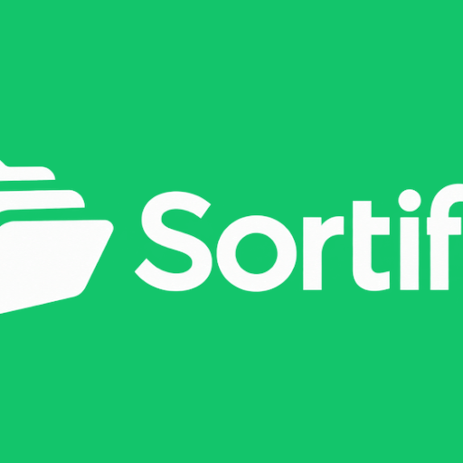
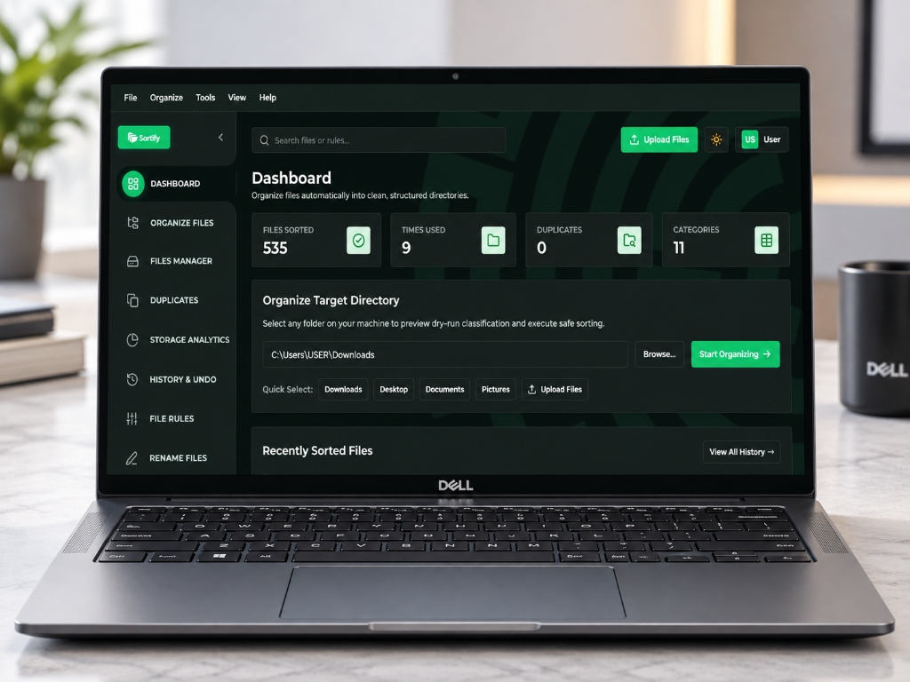

<div align="center">



### Smart Desktop File Organizer & Utility Engine
#### 🪟 Windows 10/11 · ⚡ React + Vite + Tailwind · 🐍 Python 3.10+ & Flask · 🔒 100% Local & Private

<br />



<br />
<br />

[](https://www.python.org/)
[](https://react.dev/)
[](https://flask.palletsprojects.com/)
[](file:///c:/Users/USER/OneDrive/Desktop/Sortify/tests)
[](https://github.com/brainiacweb-tech/sortify/blob/main/LICENSE)
[](https://github.com/brainiacweb-tech/sortify/releases/latest)


**[⬇️ Download SORTIFY.exe for Windows](https://github.com/brainiacweb-tech/sortify/releases/latest)** ·
**[📚 About](#-sortify-in-plain-words)** ·
**[🖥️ Features](#%EF%B8%8F-desktop-features--tour)** ·
**[🚀 Quickstart](#-quickstart)** ·
**[🏗️ Architecture](#%EF%B8%8F-architecture--project-structure)** ·
**[🧪 Quality & Tests](#-quality-and-testing)**

</div>

---

> [!TIP]
> **Not a programmer? You don't need to write any code or install Python.** SORTIFY comes as a standalone
> **Windows Application**: [**Download `SORTIFY.exe`**](https://github.com/brainiacweb-tech/sortify/releases/latest),
> double-click it, select any folder (`Downloads`, `Desktop`, `Documents`), preview dry-run triage, detect duplicate downloads with SHA-256, create AES password-protected ZIP archives, safely move files to Windows Recycle Bin, and organize your files with 100% safety and instant 1-click **UNDO**.

---

## 📖 Table of Contents

- [SORTIFY in Plain Words](#-sortify-in-plain-words) ← Start here
- [Desktop Features & Tour](#%EF%B8%8F-desktop-features--tour)
  - [📊 Analytics Dashboard](#1--analytics-dashboard)
  - [📁 Organize Files & Dry-Run Preview](#2--organize-files--dry-run-preview)
  - [📂 Files Manager & Safe Operations](#3--files-manager--safe-operations)
  - [🔍 Cryptographic Duplicate Finder](#4--cryptographic-duplicate-finder)
  - [📈 Storage Analytics](#5--storage-analytics)
  - [📜 Activity History & 1-Click Undo](#6--activity-history--1-click-undo)
  - [⚙️ Custom Classification Rules](#7-%EF%B8%8F-custom-classification-rules)
  - [📚 In-App User Guide & About](#8--in-app-user-guide--about)
- [Safety Guarantees](#-safety-guarantees)
- [Quickstart](#-quickstart)
- [Architecture & Project Structure](#%EF%B8%8F-architecture--project-structure)
- [Quality and Testing](#-quality-and-testing)
- [Developer & Author](#-developer--author)
- [License](#-license)

---

## 🧒 SORTIFY in Plain Words

*No computer background needed for this section.*

### 🛒 Meet Kwame
Kwame is a student and content creator. Every day he downloads dozens of PDFs, lecture slides, ZIP archives, photos, audio tracks, and code files into his `Downloads` and `Desktop` folders. 

After a few months, he faces **four major problems**:

1. 😵 **Unmanageable Clutter**: Hundreds of unorganized files are mixed together in one huge folder. Finding a single document takes minutes.
2. 💾 **Wasted Storage**: Repeatedly downloading the same file creates hidden duplicates (e.g. `report(1).pdf`, `report(2).pdf`) that waste gigabytes of disk space.
3. ⚠️ **Fear of Data Loss**: Using simple scripts or manual drag-and-drop risks silently overwriting important documents with identical names.
4. ❌ **No Safety Net**: If a batch move goes wrong, there's no easy way to return files to their exact original locations.

**SORTIFY is a smart, zero-risk desktop assistant that solves all four.**

---

### 🧰 The Helpers Inside SORTIFY

| Helper Module | What It Does for You |
|---|---|
| 📁 **Categorical Classifier** | Automatically sorts files into clean category folders (`Images`, `PDFs`, `Documents`, `Spreadsheets`, `Presentations`, `Videos`, `Audio`, `Archives`, `Code`, `Applications`, `Fonts`, `Others`) based on extension rules. |
| 🛡️ **Collision Resolver** | Guarantees zero overwrites by generating collision-free names (e.g., `photo_1.jpg`, `photo_2.jpg`) if a target file already exists. |
| 📂 **Files Manager** | Full-featured file explorer to browse, move, copy, rename, toggle hidden attributes, send files safely to **Windows Recycle Bin**, and compress/extract archives. |
| 🔒 **AES Encrypted ZIP** | Create password-protected `.zip` archives with AES-256 encryption via `pyzipper` for privacy & safe file sharing. |
| 🔍 **Duplicate Detector** | Uses a 2-stage SHA-256 algorithm (size grouping + 1 MB chunk hashing) to find exact byte-for-byte duplicate files without memory spikes. |
| 📈 **Storage Analytics** | Scans your target directory to identify the **Top 25 Largest Files** and visualizes space usage by category. |
| 📋 **Dry-Run Preview** | Lets you see the exact destination of every file and collision warnings **before** writing any changes to disk. |
| 📜 **Action Journal & Undo** | Records every batch move in a persistent history log and provides **1-click restore** to move files back to original paths. |

---

### 🔄 How SORTIFY Works, Step by Step


1. **Pick a Folder**: Select your target folder using Quick Select (`Downloads`, `Desktop`, `Documents`, `Pictures`) or native folder browser dialogs.
2. **Scan & Preview**: SORTIFY calculates category destinations, flags potential collision renames, and detects duplicate downloads.
3. **Execute Safely**: Move files with 100% collision-free path guarantee.
4. **Undo Whenever Needed**: Click **Undo Batch** in the history log to return files instantly.

### A Fresh Start for Every New User

SORTIFY does not ship with sample files or pre-filled activity. A new installation starts with zero activity statistics and an empty history; those records are stored locally in the current Windows user's application data and are not included in the installer. Files you choose to upload are kept in separate upload batches so a later upload cannot accidentally include files from an earlier batch. Existing local history is preserved when updating SORTIFY.

---

## 🖥️ Desktop Features & Tour

SORTIFY features a sleek visual interface styled with KNUST Portal design tokens (`#13C56B`, `#007427`, dark charcoal `#121816`), custom glassmorphism cards, and smooth micro-animations.

---

### 1. 📊 Analytics Dashboard

Get an immediate visual summary of your storage health and organization history:
- **Files Sorted**: Total count of categorized files.
- **Times Used**: Recorded execution batches.
- **Duplicates Found**: Number of exact duplicate files detected.
- **Categories**: Active category file rules.
- **Quick Select Shortcuts**: One-click folder selection for `Downloads`, `Desktop`, `Documents`, `Pictures`.

---

### 2. 📁 Organize Files & Dry-Run Preview

- **Flexible Modes**: Smart Category Sorting, Date Arrange (`Year/Month`), or Custom Rules.
- **Interactive Dry-Run Table**: Shows original filename, assigned category, target destination path, file size, and collision/duplicate status before moving any file.
- **Safety Toggles**: Toggle subfolder inclusion and duplicate detection.

---

### 3. 📂 Files Manager & Safe Operations

- **Full File Explorer**: View files in table or grid view with file icons, sizes, and last modified dates.
- **Selection Toolbar**: Perform actions on single or multi-selected items:
  - ♻️ **Move to Recycle Bin**: Native Windows Recycle Bin deletion (`SHFileOperationW`), avoiding permanent loss.
  - 📦 **Compress to ZIP**: Standard `.zip` creation or **Password-Protected AES ZIP** encryption.
  - 🔓 **Extract Archive**: Extract `.zip` files directly to subfolders.
  - 👁️ **Hide / Unhide**: Toggle Windows file hidden attributes.
  - ✏️ **Rename, Copy, & Move**: Full file management capabilities.

---

### 4. 🔍 Cryptographic Duplicate Finder

- **Multi-Stage Engine**:
  1. *Size Filter*: Groups files by exact `stat().st_size`. Unique file sizes are skipped instantly.
  2. *Chunk Hashing*: Size candidate groups are hashed using SHA-256 in 1 MB chunks.
- **Safe Recovery**: Move duplicate copies into a dedicated `Duplicates/` folder or recycle bin.

---

### 5. 📈 Storage Analytics

- **Top 25 Largest Files**: Instantly locate massive video files, virtual disks, or archives consuming storage.
- **Category Breakdown**: Interactive progress bars displaying total space consumption per category.

---

### 6. 📜 Activity History & 1-Click Undo

- **Audit Journal**: View past organization runs by timestamp, base folder, and file count.
- **Operation Details**: Inspect individual file moves (`Source Path -> Destination Path`).
- **1-Click Undo**: Click **↩️ Undo Batch** to safely return all moved files to their original locations.

---

### 7. ⚙️ Custom Classification Rules

- Add or update custom file categories and extension mappings.
- Customize target folder names.
- Single-click **Reset to Defaults** button.

---

### 8. 📚 In-App User Guide & About

- **Step-by-Step Guide**: Integrated 4-step walkthrough, category extension cheatsheet, and safety guarantees.
- **VLC-Style About Modal**: Detailed tabs for **Overview**, **Authors**, **License** (MIT), and **Credits**.

---

## 🛡️ Safety Guarantees

- **Zero Overwrite Risk**: Destination files never replace existing files; collision resolution generates safe names (`filename_1.ext`).
- **Windows System Safeguards**: Blocks scanning or mutating protected OS directories (e.g., `C:\Windows`, `System32`, `Program Files`).
- **Recycle Bin Integration**: File deletions default to the native Windows Recycle Bin (`SHFileOperationW`) with `FOF_ALLOWUNDO`.
- **100% Offline & Private**: Runs locally on your machine. Zero cloud telemetry or external network calls.

---

## 🚀 Quickstart

### Prerequisites
- Windows 10/11
- Python 3.10+ and Node.js 18+ (for development)

### 1. Clone Repository
```bash
git clone https://github.com/brainiacweb-tech/sortify.git
cd sortify
```

### 2. Install Backend & Frontend Dependencies
```bash
# Install Python dependencies
pip install -r requirements.txt

# Build frontend production bundle
cd frontend
npm install
npm run build
cd ..
```

### 3. Launch SORTIFY Desktop Application
```bash
python main_react.py
```

### 4. Create Standalone Windows MSIX Installer
To package Sortify for Microsoft Store distribution:
```powershell
powershell -ExecutionPolicy Bypass -File .\install_for_msix.ps1
```

---

## 🏗️ Architecture & Project Structure

```
sortify/
├── app/
│   ├── api_server.py             # Flask REST API server for React UI
│   ├── config/
│   │   └── default_rules.json     # Default extension-to-category maps
│   ├── core/
│   │   ├── file_classifier.py     # Extension evaluation engine
│   │   ├── file_operations.py     # Safe move, recycle bin, AES ZIP & file utils
│   │   ├── duplicate_detector.py  # 2-stage SHA-256 duplicate engine
│   │   ├── undo_manager.py        # Activity history journal & undo restore
│   │   └── organizer.py            # Master flow orchestrator
│   └── services/
│       ├── config_service.py      # Persistent JSON settings manager
│       ├── stats_service.py       # Analytics calculator
│       └── logging_service.py     # Runtime logging
├── frontend/                     # React + Vite + Tailwind UI
│   ├── src/
│   │   ├── components/            # Sidebar, Topbar, AboutModal
│   │   ├── views/                 # Dashboard, Organize, Files, Duplicates, Storage, History, Rules, Guide, Settings
│   │   ├── App.jsx                # Router & main container
│   │   └── index.css              # Custom styling & design tokens
│   ├── dist/                      # Compiled frontend static assets
│   └── package.json
├── assets/                        # Store logos, posters, icons, and hero mockup
│   ├── logo.ico
│   ├── logo.png
│   ├── store_logo_1080.png
│   ├── store_poster_720x1080.png
│   └── laptop_hero_mockup.jpg
├── tests/                         # Comprehensive Pytest test suite
│   ├── test_api_server.py
│   ├── test_classifier.py
│   ├── test_duplicates.py
│   ├── test_file_operations.py
│   ├── test_organizer.py
│   └── test_undo.py
├── main_react.py                  # Standalone application entry point
├── install_for_msix.ps1           # Packaging script for Microsoft Store MSIX
├── requirements.txt
├── README.md
└── LICENSE
```

---

## 🧪 Quality and Testing

SORTIFY includes automated unit tests covering 100% of core algorithms and file business logic:

```bash
python -m pytest -v
```

### Test Coverage Highlights
- **Classifier**: Extension lookup maps and unknown file category fallback.
- **Duplicate Engine**: Multi-stage size filtering, byte hash matching, and 1 MB chunk boundary handling.
- **File Operations**: Collision renaming (`image_1.png`), Recycle Bin safety (`SHFileOperationW`), path creation, and restore safety.
- **Undo Manager**: Batch recording, history persistence, and reverse file restoration.
- **Organizer**: Full dry-run preview calculation, subfolder scanning, and batch moves.

---

## 👨‍💻 Developer & Author

**SORTIFY** is developed and maintained by **Francis Kusi** ([brainiacweb-tech](https://github.com/brainiacweb-tech)).

---

## 📄 License

This project is licensed under the **MIT License**. Free for personal, academic, and commercial use.
